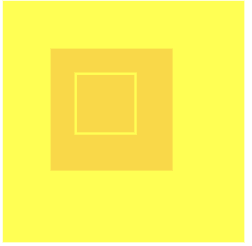
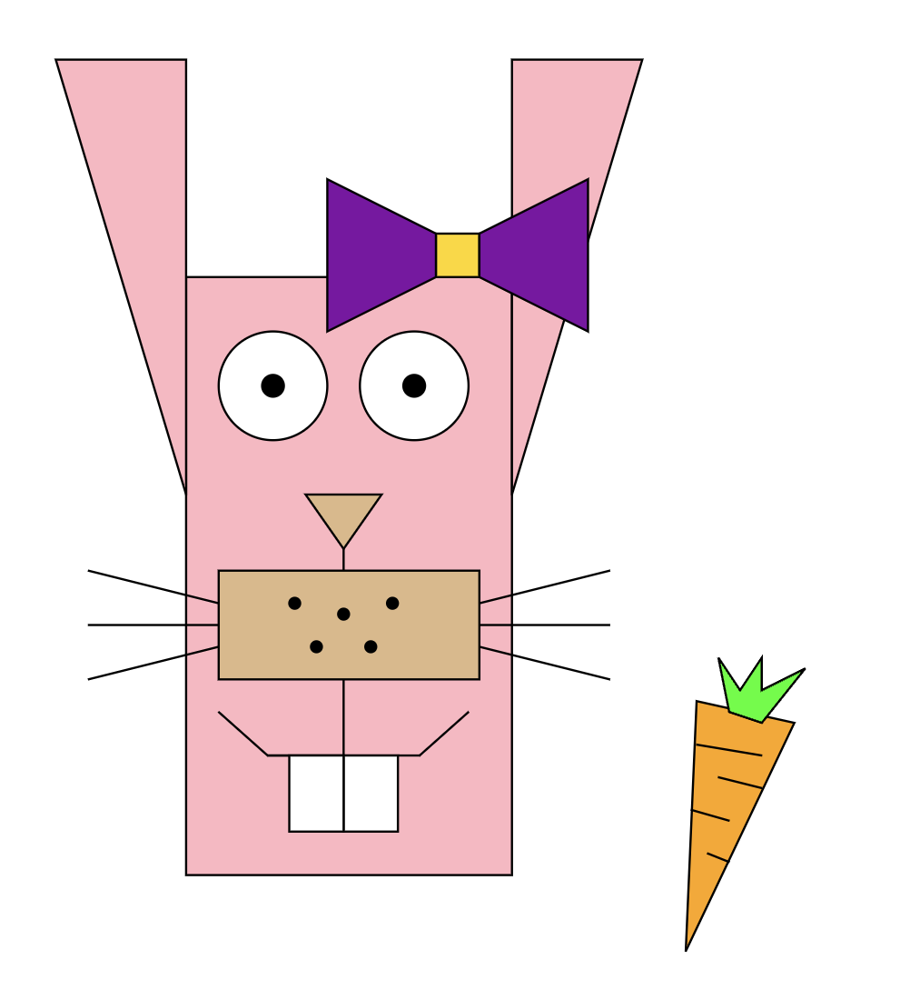
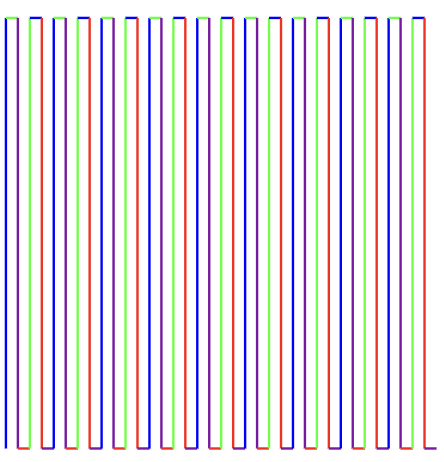
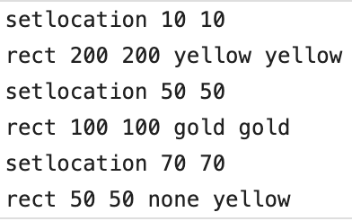
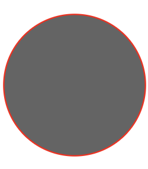

# ArtScript

*Built by Andrew Ansah and Henok Misgina Fisseha for CSCI 334, Williams College.*

## Introduction
ArtScript is designed specifically for creating geometrically intricate artwork, particularly focusing on the use of polygons and points on a coordinate plane. ArtScript blends the elegance of mathematical shapes with the creative expression of visual art. ArtScript provides built-in functions for drawing basic shapes like lines, circles, and polygons, and empowers artists to encapsulate complex patterns into reusable functions. It’s a playground for those who want to explore the beauty of geometry through code.

ArtScript serves as an excellent introduction to programming for aspiring artists and kids, offering a simplified syntax and intuitive commands for creating visually stunning geometric art and generative patterns. Its accessibility and ease of learning make it an ideal platform for beginners to explore the fundamentals of coding while unleashing their creativity through digital art. ArtScript will also encourage original artwork creation by users.

## Design Principles
ArtScript draws inspiration from the elegant simplicity and geometric artwork found in the Williams College Museum of Art. Inspired by these aesthetic principles, ArtScript is designed to replicate and extend upon these artistic styles through a programming language tailored for creating visually captivating geometric art and patterns. By providing intuitive commands and support for iterative patterns, ArtScript empowers artists to explore and express their creativity in the digital realm. We hope to be able to create crude replications of some of the artwork in the museum. The design is mainly based on using a pen to draw geometric shapes. ArtScript encourages freestyling with art, and multiple renderings or similar renderings of an artwork can be easily achieved through its combined forms.

## Language Concepts
ArtScript is a specialized programming language designed to simulate drawing with a pen with mathematical precision. Users interact with ArtScript through a set of 10 core commands: Forward, SetLocation, TurnRight, TurnLeft, Shift, Penup, Pendown, Rect, Circle, and Polygon. These commands provide the fundamental building blocks for creating a wide variety of shapes and patterns. With a basic understanding of geometry, users can effectively utilize these commands to produce complex drawings. Each command controls a specific aspect of the drawing process, whether it’s moving the pen, rotating it, or drawing geometric shapes.

One of the most powerful features of ArtScript is the `repeat` function, which allows users to execute a series of commands multiple times. This feature significantly reduces the amount of code needed to create intricate designs and patterns. By leveraging the `repeat` function, users can easily produce complex and repetitive shapes with minimal effort. Overall, ArtScript combines mathematical accuracy with a user-friendly set of commands, making it an ideal tool for creating detailed and precise drawings programmatically.

## Formal Syntax

```text
<expr> ::= <command> <expr> | <command> | <expr> <repeat> <expr> | <empty>
<repeat> ::= repeat <n> ( <expr> )
<direction> ::= up | down | left | right
<color> ::= red | green | blue | purple | black | yellow | gold | white | pink | brown | orange | RGB( <n> <n> <n>) | none
<num_pair> ::= <n> <n>
<command> ::= <command> <expr> | <command> | <empty>
            | go <n> <color>
            | setlocation <n> <n>
            | toright
            | toleft
            | penup
            | pendown
            | shift <n> <direction>
            | rect <n> <n> <color> <color>
            | circle <n> <color> <color>
            | poly <color> <color> <num_pair>*
<n> ::= (any positive integer)
```

## Semantics
Our primary primitives are commands which can be executed in order. The combining form is an `expr` which is a list of commands including the repeat function. The commands themselves utilize numbers, colors, and directions; however, these can't be used outside of commands. The repeat element works by copying a given expression a specified number of times and adding it to the drawing list.

### Commands
* **Forward (`go len color`)**: If the pen is down, draw a line from the current position in the current direction with the specified color. Update the pen's position based on the length and direction. If the pen is up, move the pen to the new position without drawing.
* **SetLocation (`setlocation x y`)**: Move the pen to the specified `(x, y)` coordinates without drawing.
* **TurnRight (`toright`)**: Change the pen's direction 90 degrees clockwise.
* **TurnLeft (`toleft`)**: Change the pen's direction 90 degrees counterclockwise.
* **Shift (`shift len dir`)**: Move the pen in the specified direction by the specified length without drawing.
* **Penup (`penup`)**: Set the pen's state to up, preventing it from drawing when moved.
* **Pendown (`pendown`)**: Set the pen's state to down, allowing it to draw when moved.
* **Rect (`rect w l fill color`)**: Draw a rectangle at the current pen position with the specified width, height, fill color, and stroke color.
* **Circle (`circle r fill color`)**: Draw a circle at the current pen position with the specified radius, fill color, and stroke color.
* **Polygon (`poly fill color coords`)**: Draw a polygon with the specified fill color and stroke color using the provided list of coordinates.

## Future Work
*Note: While the initial version of ArtScript was a collaborative class project, the future expansions listed below are being planned and developed independently by Andrew.*

While ArtScript provides a solid foundation for programmatic geometric drawing, several features are planned for future development:
* **Variables and Loops:** Adding variable assignment, standard `for` loops, and recursion trees.
* **Text Support:** The ability to render text directly onto the canvas.
* **Additional Shapes:** Support for drawing ellipses and other complex geometries.
* **Transformations:** Functionality to mirror, rotate, and scale drawn shapes.
* **Coordinate Helpers:** Quality-of-life tools to assist users in locating and designating exact coordinates on the canvas.

## Examples and Running the Code

There are example inputs provided in the `code/ArtScript/examples` folder in the repository.

To run an ArtScript program, navigate to the project directory and use `dotnet run` passing the text file as an argument:
```bash
cd code/ArtScript
dotnet run examples/rect.txt > rect.svg
```
This evaluates the commands in the text file and outputs the generated image in SVG format.

## Example Outputs

Here are some examples of what can be generated with ArtScript:

**WCMA Artwork Recreation**

*A recreation of a Josef Albers artwork found at the Williams College Museum of Art (WCMA) using ArtScript.*

**Bunny**


**Repeating Lines Pattern**


**Rectangle**


**Circle**



