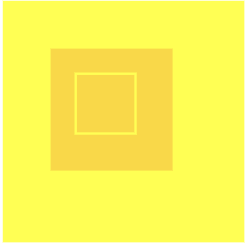
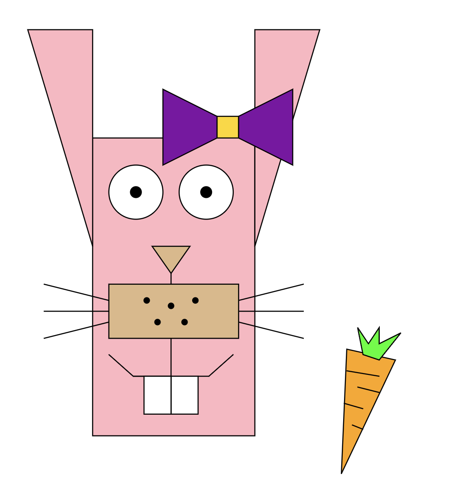
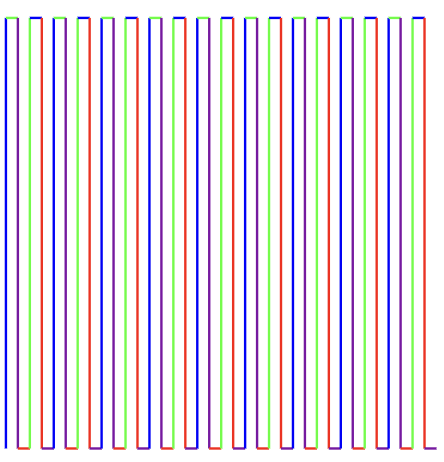
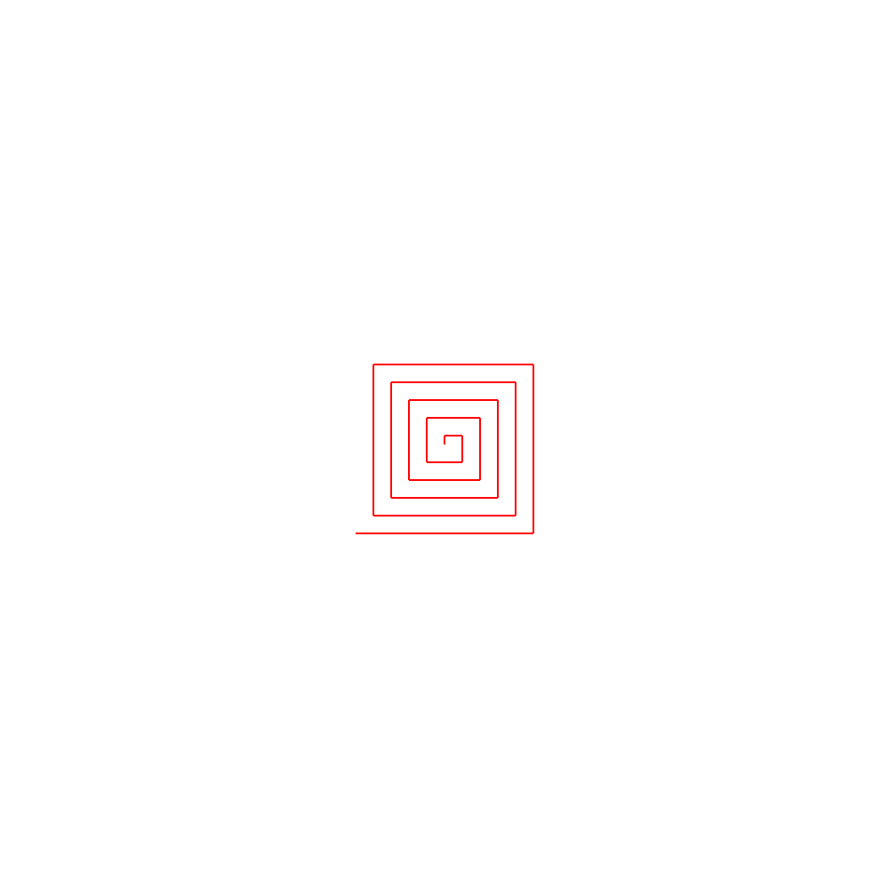
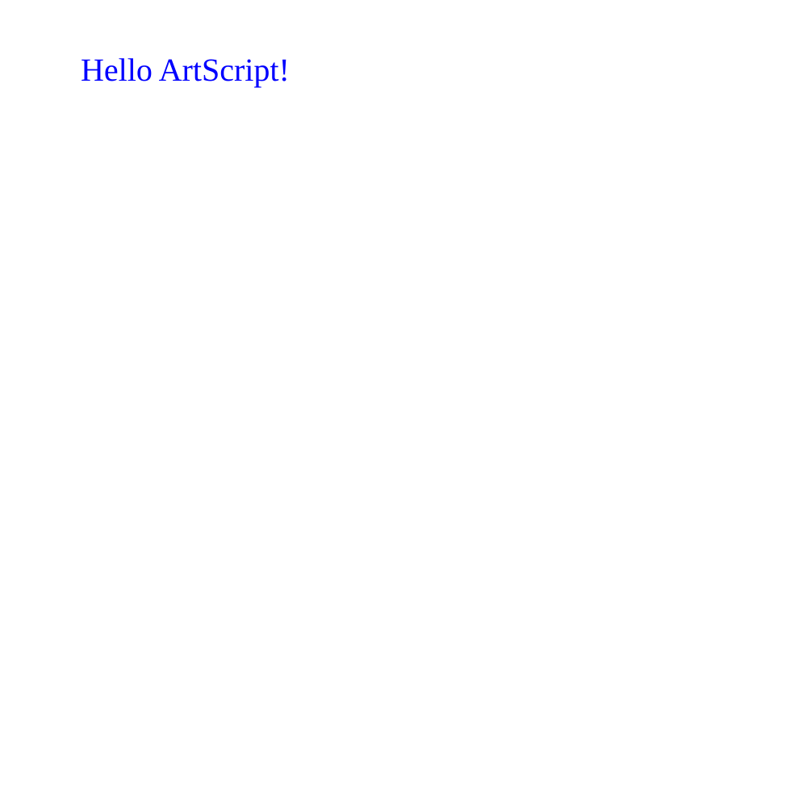
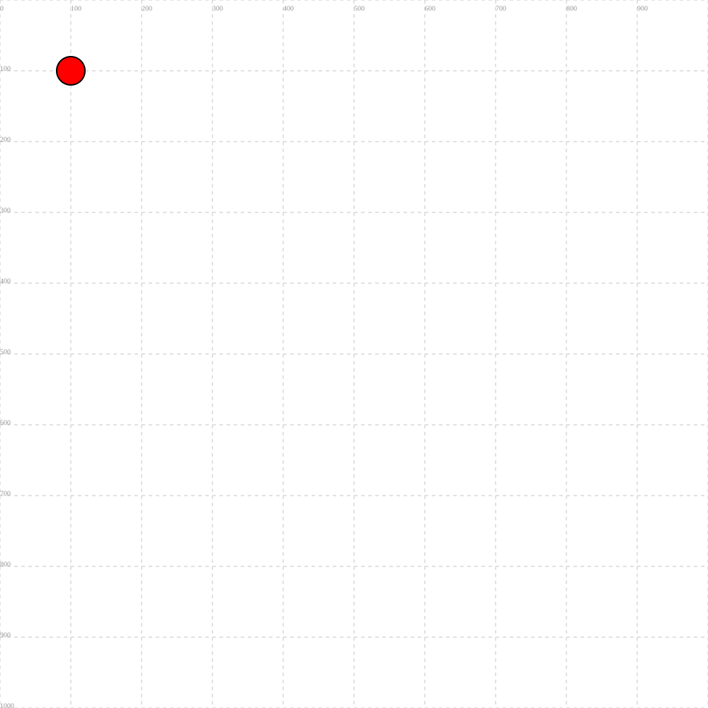
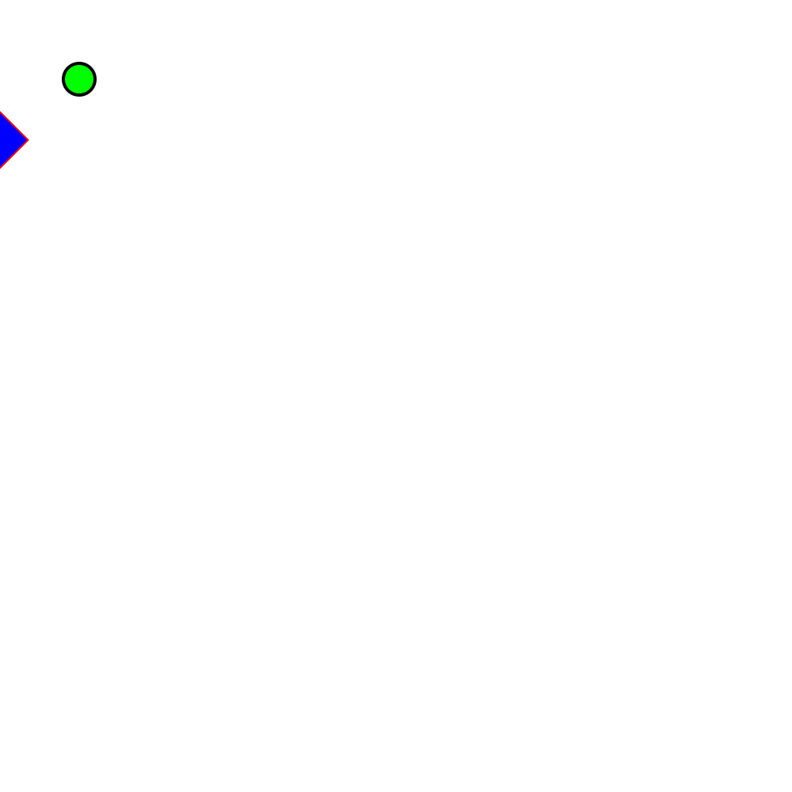

# ArtScript
*A specialized programming language for creating geometrically intricate, SVG-based artwork.*

Built by Andrew Ansah and Henok Misgina Fisseha for CSCI 334, Williams College.


*A recreation of a Josef Albers artwork found at the Williams College Museum of Art (WCMA) using ArtScript.*

## Problem and Approach
ArtScript was designed to blend the elegance of mathematical shapes with the creative expression of visual art. Inspired by the minimalist, geometric artwork at the Williams College Museum of Art, we wanted to create an accessible platform for beginners, kids, and aspiring artists to explore the fundamentals of coding while unleashing their creativity. 

Our approach was to build a custom Domain-Specific Language (DSL) that simulates a pen drawing with mathematical precision. Users interact with a concise set of core commands (like `go`, `setlocation`, `toright`) and powerful combining forms (like the `repeat` block, bounded loops, and grouped shapes) to generate complex, generative patterns with minimal code.

## Tech Stack
* **Language:** F#
* **Framework:** .NET
* **Output Format:** SVG (Scalable Vector Graphics)
* **Architecture:** Custom Parser and AST Evaluator utilizing functional state management.

## Setup Steps
To run an ArtScript program, ensure you have the .NET SDK installed. Navigate to the project directory and use `dotnet run`, passing the text file containing your ArtScript code as an argument.

```bash
cd code/ArtScript
dotnet run examples/rect.txt > rect.svg
```
This evaluates the commands in the text file and outputs the generated image in SVG format. There are various example inputs provided in the `code/ArtScript/examples` folder.

## Notes and Trade-offs

### Formal Syntax & Semantics
Our primary primitives are commands executed in order. The main combining form is an expression (`expr`), which is a list of commands including the repeat function. 

```text
<expr> ::= <command> <expr> | <command> | <expr> <repeat> <expr> | <empty>
<repeat> ::= repeat <n> ( <expr> )
<direction> ::= up | down | left | right
<color> ::= red | green | blue | purple | black | yellow | gold | white | pink | brown | orange | RGB( <n> <n> <n>) | none
<num_pair> ::= <n> <n>
<command> ::= <command> <expr> | <command> | <empty>
            | go <n> <color> | setlocation <n> <n> | toright | toleft
            | penup | pendown | shift <n> <direction>
            | rect <n> <n> <color> <color> | circle <n> <color> <color>
            | poly <color> <color> <num_pair>*
```

### Extended Features vs. Scope
The initial scope of the class project focused purely on static turtle-graphics commands. Post-submission, the language was independently extended to include dynamic features like variables (`set`), loops (`for`), grouped transformations (`rotate`, `scale`), and development helpers (`grid`). A trade-off of this functional expansion was migrating the purely static coordinate state into a dynamic environment map capable of scoping variables during AST evaluation.

*For a detailed breakdown of the development journey, architecture, and these technical trade-offs, see the [Case Study](CASE_STUDY.md).*

---

### More Examples Showcase

<details>
<summary>Click to view more ArtScript creations</summary>

**Bunny**


**Repeating Lines Pattern**


**Variables and Loops**


**Text Support**


**Coordinate Helpers (Grid)**


**Transformations**


</details>
